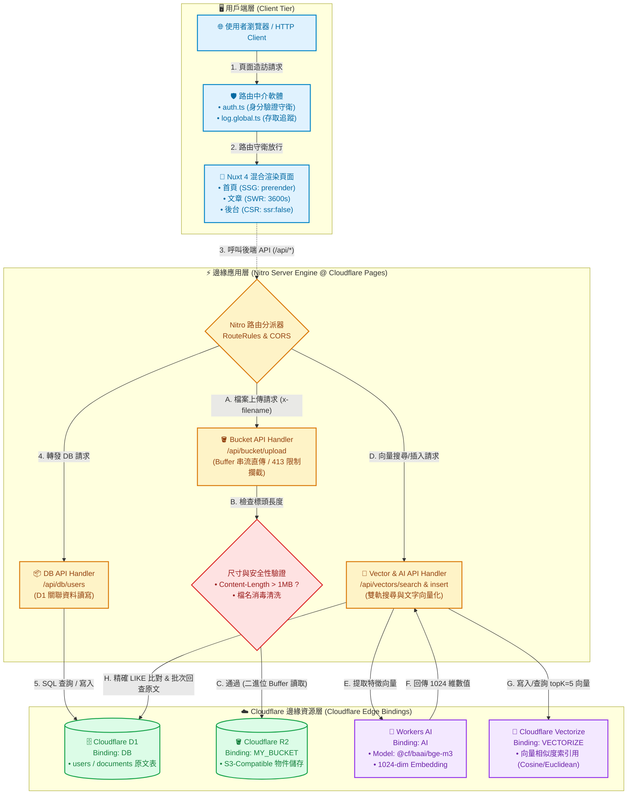

# Nuxt Fullstack Demo (Learning Project)

一個以 **Nuxt 4 + TailwindCSS + Nitro API + Cloudflare 全生態系 (D1 / R2 / Vectorize / Workers AI)** 為核心的現代邊緣全端（Edge Fullstack）實戰架構範例。專案完整實現了多元混合渲染模式（SSG / SWR / CSR）、物件儲存串流防爆流處理，以及結合 Workers AI 與向量資料庫的「精確 + 語意」雙軌混合檢索系統。

---

## 系統架構



---

## 專案結構

```text
Demo-Nuxt/
├── .env                                # 本地環境變數設定檔（NUXT_ 前綴變數注入）
├── .gitignore                          # Git 忽略配置（node_modules、dist、.nuxt 等）
├── package.json                        # 專案依賴與 NPM Scripts 定義
├── nuxt.config.ts                      # Nuxt 4 核心組態（Route Rules 混合渲染、Runtime Config、Tailwind 配置）
├── wrangler.json                       # Cloudflare Pages / Workers 資源綁定設定（D1、R2、Vectorize、AI Bindings）
├── tsconfig.json                       # TypeScript 編譯器選項與路徑對齊
├── migrations/                         # D1 資料庫遷移 SQL 指令稿
│   ├── 0001_create_users_table.sql     # 使用者資料表結構建立指令
│   └── 0002_create_documents_table.sql # 向量檢索原文文件表建立指令
├── app/                                # 前端應用核心源碼目錄
│   ├── app.vue                         # Nuxt 根元件（載入 NuxtLayout 與 NuxtPage）
│   ├── error.vue                       # 全域錯誤攔截與友善退避頁面
│   ├── assets/                         # 靜態資源目錄
│   │   └── css/                        # 樣式定義
│   │       └── main.css                # Tailwind CSS 指令進入點與自訂全域樣式
│   ├── components/                     # Vue 共用 UI 元件庫
│   │   ├── AppHeader.vue               # 前台通用導覽列元件
│   │   ├── BackStageHeader.vue         # 管理後台專用導覽列元件
│   │   └── PostCard.vue                # 文章列表展示卡片元件
│   ├── composables/                    # Vue 組合式邏輯封裝（自動引入）
│   │   ├── useAuthState.ts             # 使用者登入態與全域憑證狀態管理
│   │   ├── useBucketApi.ts             # R2 檔案上傳與列表查詢客戶端封裝
│   │   └── useCounter.ts               # 計數器響應式示範邏輯
│   ├── layouts/                        # 版面配置模組
│   │   ├── default.vue                 # 前台使用者預設外框版面
│   │   ├── backstage.vue               # 簡易後台版面配置
│   │   └── admin.vue                   # 完整權限後台管理版面配置
│   ├── middleware/                     # Nuxt 路由中介軟體
│   │   ├── auth.ts                     # 登入授權守衛（阻擋未登入訪問受保護後台）
│   │   └── log.global.ts               # 全域路由訪問日誌追蹤中介軟體
│   ├── pages/                          # 前端路由視圖（基於檔案路由系統）
│   │   ├── index.vue                   # 專案首頁（SSG 預渲染）
│   │   ├── about.vue                   # 專案簡介與功能說明頁
│   │   ├── login.vue                   # 使用者登入表單頁面
│   │   ├── contact/                    # 聯絡表單專區
│   │   │   └── index.vue               # 聯絡表單互動頁面
│   │   ├── posts/                      # 文章檢視專區
│   │   │   ├── index.vue               # 文章索引列表頁（SWR 緩存快取）
│   │   │   └── poster-[id].vue         # 動態文章詳情頁（支援特定 ID 路由渲染）
│   │   └── backstage/                  # 後台管理專區（純 CSR Client-Only）
│   │       ├── index.vue               # 後台主控儀表板
│   │       └── upload.vue              # R2 檔案上傳與物件管理介面
│   └── utils/                          # 前後端共用輔助函式與 Cloudflare Binding 封裝
│       ├── fileNameCleaning.ts         # 檔名消毒處理（移除特殊符號與空白確保安全）
│       ├── formateData.ts              # 日期時間格式化公用工具
│       ├── useAi.ts                    # Nitro 事件上下文注入 Workers AI Binding
│       ├── useBucket.ts                # Nitro 事件上下文注入 R2 Bucket Binding
│       ├── useDB.ts                    # Nitro 事件上下文注入 D1 Database Binding
│       └── useVectorize.ts             # Nitro 事件上下文注入 Vectorize Binding
├── server/                             # Nitro 後端伺服器引擎源碼
│   └── api/                            # 後端 RESTful API 路由
│       ├── bucket/                     # Cloudflare R2 物件操作端點
│       │   ├── index.get.ts            # 列舉 R2 Bucket 現有檔案清單
│       │   └── upload.post.ts          # 二進位串流檔案上傳（含 413 檔案超載防禦）
│       ├── db/                         # Cloudflare D1 資料庫操作端點
│       │   ├── users.get.ts            # 查詢用戶列表（SQL 分頁/讀取）
│       │   └── users.post.ts           # 新增使用者資料（SQL 寫入）
│       ├── vectors/                    # Workers AI + Vectorize 語意向量端點
│       │   ├── insert.post.ts          # 文本向量化（bge-m3）並雙寫入 Vectorize 與 D1
│       │   └── search.get.ts           # 混合檢索（D1 精確比對 + Vectorize AI 語意推薦）
│       ├── posts/                      # 文章資料 API
│       │   ├── index.get.ts            # 取得文章列表
│       │   └── [id].get.ts             # 取得指定文章內容
│       ├── contact.post.ts             # 聯絡我們表單提交端點
│       ├── error-test.ts               # 例外狀況與伺服器錯誤回報測試端點
│       └── hello.ts                    # 基礎連線測試端點
└── docs/                               # 完整開發教學與學習手冊
    ├── nuxt_fullstack_learning_plan.md # 全端學習主線與各階段實作藍圖
    ├── tailwindcss_guide.md            # TailwindCSS 整合技巧與樣式重置指引
    ├── cloudflare_d1_guide.md          # Cloudflare D1 建立、Migration 與指令操作手冊
    ├── cloudflare_r2_guide.md          # Cloudflare R2 串流上傳與物件儲存實務
    ├── cloudflare_vectorize_guide.md   # Workers AI 與 Vectorize 向量資料庫實戰教學
    └── default_prompt.md               # 專案初始規範提示詞紀錄
```

---

## 主要路由與渲染策略

Nuxt 4 在 `nuxt.config.ts` 中配置了細粒度的混合渲染機制（Hybrid Rendering）：

| 路由路徑 | 渲染策略 | 設定參數 | 適用情境說明 |
| :--- | :--- | :--- | :--- |
| `/` | **SSG** | `prerender: true` | 首頁靜態預渲染，極速載入並提供最佳 SEO 體質 |
| `/posts/**` | **SWR** | `swr: 3600` | 快取 1 小時後背景更新，兼顧高效能存取與內容動態保鮮 |
| `/backstage/**` | **CSR** | `ssr: false` | 後台管理頁面純客戶端渲染，節省邊緣運算資源並簡化身分驗證邏輯 |
| `/api/**` | **CORS API** | `cors: true` | 後端 Nitro API 路由，啟用跨來源資源共享支援外部整合呼叫 |

---

## 快速開始

### 1. 安裝依賴
```bash
npm install
```

### 2. 啟動本機開發伺服器
```bash
npm run dev
```
啟動完成後，開啟瀏覽器造訪 [http://localhost:3000](http://localhost:3000)。

---

## 常用指令

| 指令 | 說明 |
| :--- | :--- |
| `npm run dev` | 啟動本機 Nuxt 開發伺服器（熱重載） |
| `npm run build` | 執行標準專案打包編譯 |
| `npm run preview` | 預覽打包完成的本機專案成果 |
| `npm run build:cf` | 使用 `cloudflare_pages` Preset 進行邊緣適配編譯 |
| `npm run cf:preview` | 透過 Wrangler 本地模擬 Cloudflare Pages 執行環境 |
| `npm run cf:deploy` | 將編譯產物 `dist` 一鍵部署發佈至 Cloudflare Pages |
| `npm run cf:delete` | 刪除已建立的 Cloudflare Pages 專案實例 |

---

## 學習文件導讀指南 (docs/)

建議依循以下循序漸進的路線閱讀：

1. **[docs/nuxt_fullstack_learning_plan.md](file:///docs/nuxt_fullstack_learning_plan.md)**  
   - 掌握全端專案架構演進歷程與學習核心里程碑。
2. **[docs/tailwindcss_guide.md](file:///docs/tailwindcss_guide.md)**  
   - 了解 TailwindCSS 最佳實踐與 Preflight 樣式重置防護。
3. **[docs/cloudflare_d1_guide.md](file:///docs/cloudflare_d1_guide.md)**  
   - 熟悉邊緣 SQL 資料庫操作、本地模擬與 Schema Migration。
4. **[docs/cloudflare_r2_guide.md](file:///docs/cloudflare_r2_guide.md)**  
   - 探討 R2 串流直傳架構與記憶體防爆流設計。
5. **[docs/cloudflare_vectorize_guide.md](file:///docs/cloudflare_vectorize_guide.md)**  
   - 深入 Workers AI（bge-m3）文字向量化與 Vectorize 混合式相似檢索。

---

## Cloudflare 資源綁定注意事項

- `wrangler.json` 預設為展示用的**範例佔位值**（可安全開源提交）。
- 連接真實生產環境時，請確認於 `wrangler.json` 替換為實際資源 ID：
  - `database_name` / `database_id`（Cloudflare D1）
  - `bucket_name`（Cloudflare R2）
  - `index_name`（Cloudflare Vectorize）
- ⚠️ **資安提醒**：嚴禁將真實的 Cloudflare API Token、帳號金鑰或私有 Secret 提交至公開 Git 版本庫。

---

## 適用對象

- 欲從 Vue 3 / Nuxt 純前端跨足 Edge-Native 全端架構的開發者。
- 想掌握 Nuxt 4、Nitro Engine 與 Cloudflare 邊緣生態系（D1 / R2 / Vectorize / AI）整合的工程師。
- 尋求清晰文件化、結構標準且具備 AI 向量檢索實務的專案範本。
