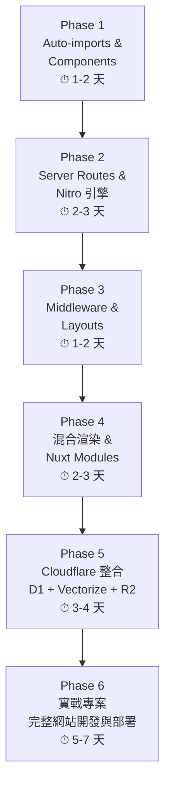

# 🎯 Nuxt 全端零成本網站 — 綜合學習計劃

> **最終目標：** 以 **0 成本**完成一個全端網站，使用 Nuxt 混合渲染（CSR + SSR），部署到 Cloudflare Workers + D1 資料庫 + R2 儲存
>
> **學習者背景：** Vue + Vite 開發經驗，具後端工程師背景
>
> **專案基礎：** `nuxt-demo`（Nuxt 4 + Vue 3.5），已完成基礎路由與資料取得

---

## 📊 目前已掌握的技能

| 功能 | 狀態 | 備註 |
|------|------|------|
| 專案初始化（Nuxt 4） | ✅ | — |
| File-based Routing | ✅ | `pages/index.vue`, `about.vue` |
| 動態路由 `[id]` | ✅ | `blog/[id].vue`, `posts/poster-[id].vue` |
| `<NuxtLink>` / `<NuxtPage>` | ✅ | — |
| `useFetch` 資料取得 | ✅ | JSONPlaceholder |
| `useRoute` 取參數 | ✅ | — |
| TypeScript 介面定義 | ✅ | `Post` interface |

---

## 🗺️ 學習階段總覽



---

## Phase 1：自動導入與目錄約定（1-2 天）

> **為什麼先學這個：** 你已經在間接使用 Auto-import（`useFetch`、`useRoute`），先建立正確的目錄結構，後續所有練習都會更順暢。

### 學習目標

- ✅ 理解 Nuxt 自動導入機制（components / composables / utils）
- ✅ 建立可重複使用的元件
- ✅ 建立自訂 Composable
- ✅ 建立工具函數

### 關鍵目錄結構

```
app/
├── components/     → 自動註冊元件，不用 import
├── composables/    → 自動導入 useXxx() 邏輯函數
├── utils/          → 自動導入純工具函數
└── pages/          → ✅ 已在使用
```

### 練習清單

```
練習 1-1：建立共用元件
├── 建立 app/components/AppHeader.vue（含導航連結）
├── 建立 app/components/AppFooter.vue
├── 在任何頁面直接用 <AppHeader />，不寫任何 import
└── ✅ 驗證：頁面正確顯示 Header/Footer

練習 1-2：建立自訂 Composable
├── 建立 app/composables/useCounter.ts
├── 導出 useCounter()（含 count, increment, decrement）
├── 在頁面中直接呼叫 const { count, increment } = useCounter()
└── ✅ 驗證：不寫 import，功能正常運作

練習 1-3：建立工具函數
├── 建立 app/utils/formatDate.ts
├── 導出 formatDate(date: Date): string
└── ✅ 驗證：在模板中直接使用 {{ formatDate(new Date()) }}
```

### 階段驗收標準

- ✅ `app/components/` 中至少有 2 個元件，且在頁面中不用 import 就能使用
- ✅ `app/composables/` 中有 1 個自訂 composable，不用 import 就能使用
- ✅ `app/utils/` 中有 1 個工具函數，不用 import 就能使用

---

## Phase 2：Nitro 引擎與 Server Routes（2-3 天）

> **為什麼重要：** 這是 Nuxt 全端能力的核心，也是讓你不需要額外後端服務的關鍵，直接影響後續 Cloudflare Workers 部署。

### 學習目標

- ✅ 理解 Nitro 引擎與 server/api 的運作原理
- ✅ 建立 GET / POST / 帶參數 的 Server Route
- ✅ 使用環境變數保護敏感資訊
- ✅ 理解 `useFetch` 搭配 Server Route 的最佳實踐

### 關鍵概念

```
Vue + Vite：前端 → 自己另開 Express/Fastify → 外部 API
Nuxt：      前端 → server/api/ (內建 Nitro) → 外部 API / DB
```

### 練習清單

```
練習 2-1：第一個 Server Route
├── 建立 server/api/hello.ts
├── 回傳 { message: 'Hello from Nitro!', timestamp: ... }
└── ✅ 驗證：頁面用 useFetch('/api/hello') 成功取得資料

練習 2-2：帶參數的 API
├── 建立 server/api/posts/[id].ts
├── 用 getRouterParam(event, 'id') 取得參數
├── 代理呼叫 JSONPlaceholder 並回傳
└── ✅ 驗證：改寫 posts 頁面，改用 /api/posts/:id（不再直接暴露外部 URL）

練習 2-3：POST 請求處理
├── 建立 server/api/contact.post.ts（.post 表示只接 POST）
├── 用 readBody(event) 讀取請求內容
└── ✅ 驗證：用 $fetch 或表單提交 POST 請求並取得回應

練習 2-4：環境變數保護
├── 建立 .env 設定 API_SECRET_KEY=my-secret
├── 在 server/api 中用 useRuntimeConfig() 讀取
├── 在 nuxt.config.ts 設定 runtimeConfig
└── ✅ 驗證：瀏覽器 DevTools 看不到這個 key
```

### 程式碼參考

```typescript
// server/api/hello.ts
export default defineEventHandler((event) => {
  return { message: 'Hello from Nitro!', timestamp: new Date().toISOString() }
})

// server/api/posts/[id].ts
export default defineEventHandler(async (event) => {
  const id = getRouterParam(event, 'id')
  return await $fetch(`https://jsonplaceholder.typicode.com/posts/${id}`)
})

// server/api/contact.post.ts
export default defineEventHandler(async (event) => {
  const body = await readBody(event)
  return { success: true, received: body }
})
```

### 階段驗收標準

- ✅ 至少 3 個 Server Route 正常運作（GET / POST / 帶參數）
- ✅ 原有 posts 頁面改用 server/api 代理，不再直接呼叫外部 API
- ✅ 環境變數正確隱藏在 server 端

### 💡 特別補充：環境變數 (.env) 的四種守備範圍
我們在實戰中學到了以下重要的全端變數觀念：
1. **什麼都沒加** (如 `API_KEY`)：Node.js 環境專屬，前端的 Vite 和 Nuxt 都不會自動載入。
2. **`VITE_` 開頭**：Vite 專屬，打包時「寫死」到前端檔案中 (`import.meta.env`)。
3. **`NUXT_` 開頭**：Nuxt 專屬，執行時即時讀取，只留在**後端/伺服器** (`useRuntimeConfig`)。
4. **`NUXT_PUBLIC_` 開頭**：Nuxt 專屬，執行時即時讀取，並且**允許送到前端** (`useRuntimeConfig().public`)。
*註：NUXT 系列的 public 變數建議在 `nuxt.config.ts` 中宣告預設值。底線命名會自動轉換為小駝峰 (camelCase)。*

---

## Phase 3：Middleware 與 Layouts（1-2 天）

> **為什麼重要：** 大型網站必備的結構化工具，你未來的網站一定需要前台/後台不同佈局和權限控制。

### 學習目標

- [ ] 理解具名 / 全域 / 行內三種 Middleware
- [ ] 建立 Layout 系統（default / admin / blank）
- [ ] 用 `definePageMeta` 指定 middleware 和 layout

### 練習清單

```
練習 3-1：建立登入驗證 Middleware
├── 建立 app/middleware/auth.ts
├── 檢查 useState('isAuth') 是否為 true
├── 沒登入導向 /login
└── ✅ 驗證：受保護頁面未登入時自動跳轉

練習 3-2：建立 Layout 系統
├── 建立 app/layouts/default.vue（Header + Footer + <slot />）
├── 建立 app/layouts/admin.vue（Sidebar + <slot />）
├── 建立 app/layouts/blank.vue（純 <slot />）
├── 前台頁面用 default，後台用 admin，登入頁用 blank
└── ✅ 驗證：不同頁面顯示不同 Layout

練習 3-3：全域 Middleware
├── 建立 app/middleware/log.global.ts
├── 記錄每次路由變化 from.path → to.path
└── ✅ 驗證：console 中看到路由變化記錄
```

### 階段驗收標準

- [ ] auth middleware 在受保護頁面正確攔截未登入使用者
- [ ] 至少 2 種不同 Layout 正常切換
- [ ] 全域 middleware 在每次路由變化時都會執行

---

## Phase 4：混合渲染 + Nuxt Modules（2-3 天）

> **為什麼重要：** 混合渲染是 Nuxt 最強大的特色，直接決定你網站的效能和 SEO。Nuxt Modules 則大幅加速開發效率。

### 學習目標

- [ ] 理解 SSR / SSG / SWR / CSR / ISR 五種渲染模式
- [ ] 在 `nuxt.config.ts` 中用 `routeRules` 設定混合渲染
- [ ] 安裝並使用核心 Nuxt Modules（Pinia、Image、Icon）

### 渲染策略對照表

| 模式 | 適用場景 | 設定方式 |
|------|----------|----------|
| SSG | 首頁、關於頁（內容不常變） | `{ prerender: true }` |
| SSR | 需要即時資料的頁面 | 預設行為 |
| SWR | 產品頁、部落格（定時更新） | `{ swr: 3600 }` |
| CSR | 管理後台（不需 SEO） | `{ ssr: false }` |
| ISR | 大量頁面 | `{ isr: 3600 }` |

### 練習清單

```
練習 4-1：設定混合渲染規則
├── 在 nuxt.config.ts 設定 routeRules
│   ├── '/'         → prerender: true（SSG）
│   ├── '/admin/**' → ssr: false（CSR）
│   └── '/posts/**' → swr: 3600（SWR）
├── 用「檢視原始碼」比較 SSR vs CSR 頁面的 HTML
└── ✅ 驗證：SSR 頁面有完整 HTML，CSR 頁面只有空殼

練習 4-2：安裝 Pinia 狀態管理
├── npx nuxi module add pinia
├── 建立 app/stores/counter.ts（defineStore）
└── ✅ 驗證：跨頁面狀態共享正常

練習 4-3：安裝 @nuxt/image
├── npx nuxi module add image
├── 用 <NuxtImg> 替代 
└── ✅ 驗證：圖片自動優化（format, quality）

練習 4-4：安裝 @nuxt/icon
├── npx nuxi module add icon
├── 使用 <Icon name="heroicons:home" />
└── ✅ 驗證：圖示正確顯示
```

### 階段驗收標準

- [ ] `routeRules` 正確設定 3 種以上渲染模式
- [ ] Pinia store 跨頁面狀態共享正常
- [ ] 至少安裝 2 個 Nuxt Module 並正常使用

---

## Phase 5：Cloudflare 整合（3-4 天）

> [!IMPORTANT]
> 這是實現「0 成本部署」的關鍵階段。你需要理解 Cloudflare 的免費方案額度，以及如何將 Nuxt 與 D1、Vectorize、R2、Workers 整合。

### Cloudflare 免費額度一覽

| 服務 | 免費額度 |
|------|----------|
| **Workers** | 每天 100,000 請求 |
| **D1 資料庫** | 5GB 儲存、500 萬讀取/月、10 萬寫入/月 |
| **Vectorize** | 3,000 萬次查詢/月、500 萬個向量維度 |
| **R2 儲存** | 10GB 儲存、無流出費用 |
| **Pages** | 無限靜態站台、500 次建置/月 |

### 學習目標
- [x] 註冊 Cloudflare 帳號並建立 D1 資料庫
- [ ] 建立 Vectorize 索引 + R2 Bucket
- [x] 設定 `wrangler.json` 綁定 D1
- [ ] 設定 `wrangler.json` 綁定 Vectorize 和 R2
- [x] 在 Server Route 中存取 D1（SQL 操作）
- [ ] 在 Server Route 中存取 Vectorize（向量搜尋）和 R2（檔案儲存）
- [x] 使用 `cloudflare_pages` preset 建置與部署 (`npm run cf:preview`)
- [x] 了解 NuxtHub 作為管理工具的角色

### 練習清單

```
練習 5-1：環境設定
├── ✅ 安裝 wrangler：npm install -D wrangler
├── ✅ 登入 Cloudflare：npx wrangler login
├── ✅ 建立 D1 資料庫：npx wrangler d1 create demo-db
├── 建立 R2 Bucket：npx wrangler r2 bucket create my-bucket
└── ✅ 驗證：在 Cloudflare Dashboard 看到 D1 資源

練習 5-2：設定 Wrangler 綁定
├── ✅ 建立 wrangler.json
│   {
│     "d1_databases": [
│       { "binding": "DB", "database_name": "demo-db", "database_id": "xxx" }
│     ]
│   }
├── ✅ 設定 package.json：建立 `build:cf` 與 `cf:preview`
└── ✅ 驗證：本地開發 (`cf:preview`) 可以存取 bindings

練習 5-3：D1 資料庫操作
├── ✅ 建立 migrations 資料夾並寫 SQL schema
├── ✅ 建立 server/api/db/users.get.ts（讀取）
├── ✅ 建立 server/api/db/users.post.ts（新增）
├── ✅ 透過 event.context.cloudflare.env.DB 存取
└── ✅ 驗證：CRUD 操作正常

練習 5-4：R2 檔案儲存
├── 建立 server/api/upload.post.ts（上傳檔案到 R2）
├── 建立 server/api/files/[key].get.ts（讀取檔案）
├── 透過 event.context.cloudflare.env.MY_BUCKET 存取
└── ✅ 驗證：上傳和下載檔案正常

練習 5-5：部署到 Cloudflare
├── npx nuxi build --preset=cloudflare_pages
├── npx wrangler pages deploy dist/
├── 在 Cloudflare Dashboard 設定 production bindings
├── 執行 D1 migrations：npx wrangler d1 migrations apply my-db
└── ✅ 驗證：線上網站可正常存取 D1 和 R2

練習 5-6：Vectorize 向量資料庫操作 (AI 擴充)
├── 建立 Vectorize 索引：npx wrangler vectorize create my-index --dimensions=768 --metric=cosine
├── 綁定 wrangler.jsonc：{ "vectorize": [{ "binding": "VECTORIZE", "index_name": "my-index" }] }
├── 建立 server/api/search.ts，透過 event.context.cloudflare.env.VECTORIZE 存取
└── ✅ 驗證：能夠寫入向量並進行相似度搜尋
```

### D1 操作程式碼參考

```typescript
// server/api/users.get.ts
export default defineEventHandler(async (event) => {
  const db = event.context.cloudflare.env.DB
  const { results } = await db.prepare('SELECT * FROM users').all()
  return results
})

// server/api/users.post.ts
export default defineEventHandler(async (event) => {
  const db = event.context.cloudflare.env.DB
  const body = await readBody(event)
  await db.prepare('INSERT INTO users (name, email) VALUES (?, ?)')
    .bind(body.name, body.email)
    .run()
  return { success: true }
})
```

### R2 操作程式碼參考

```typescript
// server/api/upload.post.ts
export default defineEventHandler(async (event) => {
  const bucket = event.context.cloudflare.env.MY_BUCKET
  const body = await readRawBody(event)
  const key = `uploads/${Date.now()}`
  await bucket.put(key, body)
  return { key }
})
```

### 階段驗收標準

- [ ] D1 資料庫 CRUD 在本地與線上都正常
- [ ] Vectorize 向量寫入與搜尋正常
- [ ] R2 檔案上傳/讀取正常
- [ ] 網站成功部署到 Cloudflare，可透過公開 URL 存取
- [ ] 確認所有資源都在免費額度內

---

## Phase 6：實戰專案 — 完整網站開發與部署（5-7 天）

> [!TIP]
> 這個階段是把前 5 個 Phase 的所有技能整合在一起，完成一個真正可上線的全端網站。網站用途可以之後再決定，先把架構搭好。

### 推薦的起步專案方向

| 方向 | 涵蓋技術 | 複雜度 |
|------|----------|--------|
| **個人部落格** | SSG/ISR + D1 + Markdown | ⭐⭐ |
| **小型 SaaS 工具** | SSR + D1 + R2 + Auth | ⭐⭐⭐ |
| **作品集網站** | SSG + R2（圖片儲存） | ⭐ |

### 建議的網站架構（通用模板）

```
nuxt-demo/
├── app/
│   ├── components/        # 共用元件
│   │   ├── AppHeader.vue
│   │   ├── AppFooter.vue
│   │   └── ui/            # UI 元件庫
│   ├── composables/       # 共用邏輯
│   │   ├── useAuth.ts
│   │   └── useD1.ts
│   ├── layouts/           # 佈局
│   │   ├── default.vue
│   │   ├── admin.vue
│   │   └── blank.vue
│   ├── middleware/         # 中間件
│   │   └── auth.ts
│   ├── pages/             # 頁面（混合渲染）
│   │   ├── index.vue      # SSG — 首頁
│   │   ├── about.vue      # SSG — 關於
│   │   ├── blog/          # ISR — 部落格
│   │   ├── admin/         # CSR — 後台管理
│   │   └── login.vue      # blank layout
│   ├── stores/            # Pinia 狀態管理
│   │   └── auth.ts
│   └── utils/             # 工具函數
├── server/
│   ├── api/               # API Routes
│   │   ├── auth/
│   │   ├── posts/
│   │   └── upload/
│   ├── middleware/         # Server Middleware
│   └── utils/             # Server 工具
├── migrations/            # D1 SQL Migrations
├── nuxt.config.ts
├── wrangler.jsonc
└── .env
```

### nuxt.config.ts 最終配置參考

```typescript
export default defineNuxtConfig({
  compatibilityDate: '2025-07-15',
  devtools: { enabled: true },

  modules: [
    '@pinia/nuxt',
    '@nuxt/image',
    '@nuxt/icon',
  ],

  routeRules: {
    '/':            { prerender: true },    // SSG
    '/about':       { prerender: true },    // SSG
    '/blog/**':     { isr: 3600 },          // ISR
    '/admin/**':    { ssr: false },          // CSR
    '/api/**':      { cors: true },         // API
  },

  nitro: {
    preset: 'cloudflare_pages',
  },

  runtimeConfig: {
    apiSecret: '',  // 從 .env 讀取，僅 server 端可用
    public: {
      appName: 'My Nuxt App',
    },
  },
})
```

### 階段驗收標準

- [ ] 完整網站包含前台 + 後台
- [ ] 混合渲染策略正確套用（至少 3 種模式）
- [ ] D1 資料庫 CRUD 正常運作
- [ ] R2 檔案儲存功能正常
- [ ] Auth middleware 保護後台頁面
- [ ] 成功部署到 Cloudflare，公開 URL 可存取
- [ ] 所有資源在免費額度內（0 成本）

---

## ⏱️ 預估總學習時間

| 階段 | 預估天數 | 累計 |
|------|----------|------|
| Phase 1：Auto-imports & Components | 1-2 天 | 1-2 天 |
| Phase 2：Server Routes & Nitro | 2-3 天 | 3-5 天 |
| Phase 3：Middleware & Layouts | 1-2 天 | 4-7 天 |
| Phase 4：混合渲染 & Modules | 2-3 天 | 6-10 天 |
| Phase 5：Cloudflare 整合 | 3-4 天 | 9-14 天 |
| Phase 6：實戰專案 | 5-7 天 | 14-21 天 |
| **總計** | **14-21 天** | — |

---

## 📚 學習資源彙整

| 資源 | 說明 |
|------|------|
| [Nuxt 官方文件](https://nuxt.com/docs) | 核心參考 |
| [Nitro 文件](https://nitro.build) | Server Route 進階用法 |
| [Nuxt 模組總覽](https://nuxt.com/modules) | 所有可用模組 |
| [Cloudflare D1 文件](https://developers.cloudflare.com/d1/) | 資料庫操作 |
| [Cloudflare Vectorize 文件](https://developers.cloudflare.com/vectorize/) | 向量資料庫（AI 應用） |
| [Cloudflare R2 文件](https://developers.cloudflare.com/r2/) | 檔案儲存 |
| [Cloudflare Workers 文件](https://developers.cloudflare.com/workers/) | 部署與運行 |
| [NuxtHub](https://hub.nuxt.com/) | Nuxt + Cloudflare 管理平台 |
| [Cloudflare 免費額度](https://www.cloudflare.com/plans/developer-platform/) | 計費資訊 |

---

## 🤖 AI 輔助學習指引

> [!NOTE]
> 每個 Phase 都有明確的練習清單和驗收標準。學習時請依序進行，每完成一個 Phase 就通知 AI 進入下一階段。

當你要開始學習時，對 AI 說：

```
請根據 nuxt_fullstack_learning_plan.md，帶我開始 Phase X 的學習。
```

AI 將會：
1. **講解** 該階段的核心概念
2. **引導** 你完成每個練習
3. **提供** 完整的程式碼範例
4. **驗證** 你的實作是否正確
5. **解答** 你遇到的任何問題

每完成一個 Phase 的所有驗收標準後，再進入下一個 Phase。
