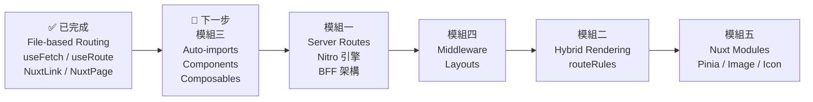

# 🚀 Nuxt.js 核心學習路線圖

> **目標：** 從 Vue + Vite 開發者進階到 Nuxt 全端工程師
>
> 以下是進入 Nuxt 世界最推薦學習的 **5 個核心模組**，這些功能是純 Vue + Vite 沒有、或需要花很大力氣配置的。

---

## 📊 目前進度總覽

根據 `nuxt-demo` 專案，你已經完成的練習：

| 功能 | 狀態 | 說明 |
|------|------|------|
| 專案初始化 | ✅ 已完成 | Nuxt 4 + Vue 3.5 |
| File-based Routing | ✅ 已完成 | `pages/index.vue`, `pages/about.vue` |
| 動態路由 `[id]` | ✅ 已完成 | `blog/[id].vue`, `posts/poster-[id].vue` |
| `<NuxtLink>` 導航 | ✅ 已完成 | 頁面間跳轉 |
| `<NuxtPage>` 渲染 | ✅ 已完成 | `app.vue` 中使用 |
| `useFetch` 資料取得 | ✅ 已完成 | 從 JSONPlaceholder 取資料 |
| `useRoute` 取參數 | ✅ 已完成 | 在 `poster-[id].vue` 中使用 |
| TypeScript 介面定義 | ✅ 已完成 | `Post` interface |
| Server Routes (API) | ⬜ 尚未開始 | — |
| 混合渲染模式 | ⬜ 尚未開始 | — |
| Auto-imports | 🟡 間接使用 | 已自動導入 `useFetch`、`useRoute`，但尚未自己寫 composable |
| Middleware | ⬜ 尚未開始 | — |
| Layouts | ⬜ 尚未開始 | — |
| Nuxt Modules | ⬜ 尚未開始 | — |

---

## 模組一：Nitro 引擎與 Server Routes（BFF 架構）

> [!IMPORTANT]
> 這是 Nuxt 的靈魂，也是身為後端工程師會**最感興趣**的部分。

### 🎯 學習重點

在 `server/api/` 資料夾下直接寫後端邏輯，無需額外開一個 Node.js 專案。

### 💡 為什麼推薦

| 優勢 | 說明 |
|------|------|
| **零配置 API** | 寫好 `server/api/hello.ts`，前端直接 `useFetch('/api/hello')` 就能拿到資料，連路由都不用配 |
| **安全性** | 可以在這裡隱藏 API Keys 或進行資料清洗，瀏覽器端**完全看不到** |
| **全端合一** | 不需要再額外開一個後端服務來做簡單的 API 代理 |

### 🔧 與 Vue + Vite 比較

```
Vue + Vite：前端 → 自己另開 Express/Fastify → 外部 API
Nuxt：      前端 → server/api/ (內建) → 外部 API
```

### 📝 建議練習

```
練習 1-1：建立第一個 Server Route
├── 建立 server/api/hello.ts
├── 回傳 { message: 'Hello from Nitro!' }
└── 在頁面中用 useFetch('/api/hello') 取得資料

練習 1-2：帶參數的 API
├── 建立 server/api/posts/[id].ts
├── 用 getRouterParam(event, 'id') 取得參數
└── 代理呼叫 JSONPlaceholder 並回傳結果

練習 1-3：POST 請求處理
├── 建立 server/api/contact.post.ts
├── 用 readBody(event) 讀取請求內容
└── 回傳確認訊息

練習 1-4：環境變數保護
├── 在 .env 設定 API_SECRET_KEY
├── 在 server/api 中使用 useRuntimeConfig() 讀取
└── 確認瀏覽器端看不到這個 key
```

### 📄 程式碼範例

```typescript
// server/api/hello.ts
export default defineEventHandler((event) => {
  return {
    message: 'Hello from Nitro!',
    timestamp: new Date().toISOString()
  }
})
```

```typescript
// server/api/posts/[id].ts
export default defineEventHandler(async (event) => {
  const id = getRouterParam(event, 'id')
  const post = await $fetch(`https://jsonplaceholder.typicode.com/posts/${id}`)
  return post
})
```

```typescript
// server/api/contact.post.ts — 注意檔名中的 .post 表示只接 POST
export default defineEventHandler(async (event) => {
  const body = await readBody(event)
  return { success: true, received: body }
})
```

---

## 模組二：混合渲染模式（Hybrid Rendering）

> [!NOTE]
> 在純 Vue 裡，你通常只能選擇 CSR。在 Nuxt 裡，你可以針對「**每一頁**」設定不同的渲染方式。

### 🎯 學習重點

理解不同渲染策略的使用時機：

| 模式 | 全稱 | 適用場景 | 特點 |
|------|------|----------|------|
| **SSR** | Server-Side Rendering | 需要 SEO 的頁面 | 每次請求由伺服器渲染 HTML |
| **SSG** | Static Site Generation | 內容不常變的頁面 | 建置時預先生成，速度最快 |
| **SWR** | Stale-While-Revalidate | 資料需定期更新的頁面 | 先給快取、背景更新 |
| **CSR** | Client-Side Rendering | 管理後台 | 跟純 Vue 一樣 |
| **ISR** | Incremental Static Regeneration | 大量頁面的站台 | 結合 SSG + SWR |

### 🏗️ 實戰場景規劃

```
你的網站
├── /               → SSG（秒開，首頁不常變）
├── /products/:id   → SWR（快取 1 小時，之後自動更新）
├── /blog/:slug     → ISR（文章很多，不可能全部預先生成）
├── /admin/*        → CSR（跟純 Vue 一樣，不需要 SEO）
└── /dashboard      → SSR（需要即時數據）
```

### 📝 建議練習

```
練習 2-1：設定混合渲染規則
├── 在 nuxt.config.ts 中設定 routeRules
├── 將首頁設為 SSG（prerender: true）
├── 將 /admin 設為 CSR（ssr: false）
└── 將 /posts 設為 SWR（swr: 3600）

練習 2-2：觀察渲染差異
├── 使用瀏覽器「檢視原始碼」
├── 比較 SSR 頁面 vs CSR 頁面的 HTML 差異
└── 理解 SEO 為什麼需要 SSR/SSG
```

### 📄 程式碼範例

```typescript
// nuxt.config.ts
export default defineNuxtConfig({
  compatibilityDate: '2025-07-15',
  devtools: { enabled: true },

  routeRules: {
    '/':            { prerender: true },           // SSG — 建置時生成
    '/admin/**':    { ssr: false },                // CSR — 純前端渲染
    '/posts/**':    { swr: 3600 },                 // SWR — 快取 1 小時
    '/api/**':      { cors: true },                // API — 允許跨域
  }
})
```

---

## 模組三：自動導入與目錄約定（Auto-imports & Directory Structure）

> [!TIP]
> 這會徹底改變你的開發節奏。你的 `<script setup>` 會變得異常乾淨，開發效率提升 30% 以上。

### 🎯 學習重點

| 目錄 | 功能 | 說明 |
|------|------|------|
| `app/components/` | 自動註冊元件 | 丟進去就能直接在 template 中用，不用 `import` |
| `app/composables/` | 自動導入邏輯函數 | 你自己寫的 `useXxx()` 也能自動導入 |
| `app/utils/` | 自動導入工具函數 | 純函數（format、validate 等）自動可用 |
| `app/pages/` | 自動路由 | ✅ 你已經在用了！ |

### 🔧 與 Vue + Vite 比較

```diff
- // Vue + Vite：每個檔案都要手動 import
- import { ref, computed } from 'vue'
- import { useCounter } from '@/composables/useCounter'
- import MyButton from '@/components/MyButton.vue'

+ // Nuxt：全部自動導入，直接使用
+ // ref, computed → 自動
+ // useCounter   → 自動（放在 composables/ 資料夾下）
+ // MyButton     → 自動（放在 components/ 資料夾下）
```

### 📝 建議練習

```
練習 3-1：建立可重複使用的元件
├── 建立 app/components/AppHeader.vue
├── 建立 app/components/AppFooter.vue
├── 在任何頁面直接使用 <AppHeader />
└── 不需要寫任何 import 語句

練習 3-2：建立自訂 Composable
├── 建立 app/composables/useCounter.ts
├── 導出 useCounter() 函數（含 count, increment, decrement）
├── 在頁面中直接呼叫 const { count, increment } = useCounter()
└── 驗證不需要 import 就能使用

練習 3-3：建立工具函數
├── 建立 app/utils/formatDate.ts
├── 導出 formatDate(date: Date): string
└── 在任何地方直接呼叫 formatDate(new Date())
```

### 📄 程式碼範例

```typescript
// app/composables/useCounter.ts
export const useCounter = (initialValue = 0) => {
  const count = ref(initialValue)
  const increment = () => count.value++
  const decrement = () => count.value--
  const reset = () => count.value = initialValue

  return { count, increment, decrement, reset }
}
```

```vue
<!-- app/components/AppHeader.vue -->
<template>
  <header>
    <nav>
      <NuxtLink to="/">🏠 首頁</NuxtLink>
      <NuxtLink to="/about">📖 關於</NuxtLink>
      <NuxtLink to="/posts">📋 文章</NuxtLink>
    </nav>
  </header>
</template>
```

```vue
<!-- 在任何頁面中 — 注意完全沒有 import -->
<template>
  <div>
    <AppHeader />
    <p>計數器：{{ count }}</p>
    <button @click="increment">+1</button>
  </div>
</template>

<script setup lang="ts">
const { count, increment } = useCounter()
</script>
```

---

## 模組四：路由中間件（Middleware）& 佈局系統（Layouts）

> [!IMPORTANT]
> 這對大型專案的結構化非常有幫助。在 Vue + Vite 裡，你可能要在 `vue-router` 寫很長的導航守衛，Nuxt 則是分檔案管理，清晰得多。

### 🎯 學習重點

#### Middleware（中間件）

在進入頁面之前進行攔截處理（例如：權限校驗、登入檢查）。

| 類型 | 檔案位置 | 說明 |
|------|----------|------|
| **具名中間件** | `app/middleware/auth.ts` | 需要在頁面中手動指定使用 |
| **全域中間件** | `app/middleware/auth.global.ts` | 每次路由變化都會執行 |
| **行內中間件** | 頁面內 `definePageMeta` | 只在該頁面生效 |

#### Layouts（佈局系統）

輕鬆切換不同頁面的 UI 結構。

| Layout | 用途 |
|--------|------|
| `default.vue` | 一般前台頁面（含 Header + Footer） |
| `admin.vue` | 後台管理頁面（含 Sidebar） |
| `blank.vue` | 空白頁面（登入頁、錯誤頁） |

### 🔧 與 Vue + Vite 比較

```diff
- // Vue + Vite：在 router/index.ts 中寫導航守衛
- router.beforeEach((to, from) => {
-   if (to.meta.requiresAuth && !isLoggedIn()) {
-     return '/login'
-   }
- })

+ // Nuxt：獨立檔案，職責明確
+ // app/middleware/auth.ts
+ export default defineNuxtRouteMiddleware((to, from) => {
+   const isLoggedIn = false // 實際上從 useState 或 cookie 取得
+   if (!isLoggedIn) {
+     return navigateTo('/login')
+   }
+ })
```

### 📝 建議練習

```
練習 4-1：建立登入驗證 Middleware
├── 建立 app/middleware/auth.ts
├── 檢查使用者是否已登入
├── 沒登入就導向 /login
└── 在需要保護的頁面中使用 definePageMeta({ middleware: 'auth' })

練習 4-2：建立 Layout 系統
├── 建立 app/layouts/default.vue（含 Header + Footer）
├── 建立 app/layouts/admin.vue（含 Sidebar）
├── 前台頁面使用 default layout
└── 後台頁面使用 definePageMeta({ layout: 'admin' })

練習 4-3：全域 Middleware
├── 建立 app/middleware/log.global.ts
├── 記錄每次路由變化的 from → to
└── 理解 .global 後綴的作用
```

### 📄 程式碼範例

```typescript
// app/middleware/auth.ts
export default defineNuxtRouteMiddleware((to, from) => {
  // 這裡可以檢查 cookie、token、或全域狀態
  const isAuthenticated = useState<boolean>('isAuth', () => false)

  if (!isAuthenticated.value && to.path !== '/login') {
    return navigateTo('/login')
  }
})
```

```vue
<!-- app/layouts/default.vue -->
<template>
  <div class="layout-default">
    <AppHeader />
    <main>
      <slot />  <!-- 頁面內容會被插入這裡 -->
    </main>
    <AppFooter />
  </div>
</template>
```

```vue
<!-- app/layouts/admin.vue -->
<template>
  <div class="layout-admin">
    <aside>
      <nav>
        <NuxtLink to="/admin">📊 Dashboard</NuxtLink>
        <NuxtLink to="/admin/users">👥 Users</NuxtLink>
        <NuxtLink to="/admin/settings">⚙️ Settings</NuxtLink>
      </nav>
    </aside>
    <main>
      <slot />
    </main>
  </div>
</template>
```

```vue
<!-- 在受保護的頁面中使用 -->
<script setup lang="ts">
definePageMeta({
  middleware: 'auth',      // 使用 auth 中間件
  layout: 'admin'          // 使用 admin 佈局
})
</script>
```

---

## 模組五：Nuxt 模組生態系（Nuxt Modules）

> [!NOTE]
> 這是 Nuxt 的「外掛超市」。模組會幫你把所有 plugins 裝好，你只需要在 `nuxt.config.ts` 寫上名字就能用。

### 🎯 推薦學習的模組

| 模組 | 功能 | 安裝指令 |
|------|------|----------|
| `@nuxtjs/tailwindcss` | 一鍵配置 Tailwind CSS | `npx nuxi module add tailwindcss` |
| `@pinia/nuxt` | 自動配置狀態管理 | `npx nuxi module add pinia` |
| `@nuxt/image` | 自動優化圖片大小 | `npx nuxi module add image` |
| `@nuxt/fonts` | 自動優化字型載入 | `npx nuxi module add fonts` |
| `@vueuse/nuxt` | 200+ 實用 composables | `npx nuxi module add vueuse` |
| `@nuxt/icon` | 10 萬+ 圖示庫直接用 | `npx nuxi module add icon` |

### 🔧 與 Vue + Vite 比較

```diff
- // Vue + Vite：手動安裝 + 手動配置
- npm install tailwindcss postcss autoprefixer
- npx tailwindcss init -p
- // 還要建立 tailwind.config.js, postcss.config.js
- // 還要在 main.css 加入 @tailwind 指令
- // 還要在 main.ts 引入 css 檔案

+ // Nuxt：一行搞定
+ npx nuxi module add tailwindcss
+ // 就這樣，可以直接用了 ✅
```

### 📝 建議練習

```
練習 5-1：安裝並使用 Pinia
├── npx nuxi module add pinia
├── 建立 app/stores/counter.ts
├── 使用 defineStore 建立 store
└── 在頁面中直接使用（自動導入）

練習 5-2：安裝 @nuxt/image
├── npx nuxi module add image
├── 使用 <NuxtImg> 替代 
├── 觀察自動產生的圖片尺寸優化
└── 試用 format、quality、sizes 屬性

練習 5-3：安裝 @nuxt/icon
├── npx nuxi module add icon
├── 使用 <Icon name="heroicons:home" />
└── 瀏覽 https://icones.js.org 挑選圖示
```

### 📄 程式碼範例

```typescript
// nuxt.config.ts — 安裝模組後會自動更新
export default defineNuxtConfig({
  compatibilityDate: '2025-07-15',
  devtools: { enabled: true },

  modules: [
    '@nuxtjs/tailwindcss',
    '@pinia/nuxt',
    '@nuxt/image',
    '@nuxt/icon',
  ],
})
```

```typescript
// app/stores/counter.ts — Pinia Store
export const useCounterStore = defineStore('counter', () => {
  const count = ref(0)
  const doubleCount = computed(() => count.value * 2)
  const increment = () => count.value++

  return { count, doubleCount, increment }
})
```

---

## 🗺️ 建議學習順序



> [!TIP]
> **建議先從模組三開始**，因為你已經在間接使用 Auto-import（`useFetch`、`useRoute` 都是自動導入的），只是還沒自己建立 `components/` 和 `composables/`。接著進入 Server Routes，這會讓你的 `posts` 頁面可以改用內建 API 代理，不再直接暴露外部 API 網址。

---

## 🎯 進階挑戰（全部學完後）

完成以上 5 個核心模組後，可以挑戰的綜合練習：

| 挑戰 | 涵蓋模組 | 說明 |
|------|----------|------|
| **建立部落格系統** | 1, 2, 3, 4, 5 | 含前台展示 + 後台管理 + Markdown 渲染 |
| **Todo App（全端）** | 1, 3, 4 | Server Route 做 CRUD + Pinia 管理狀態 |
| **Dashboard 儀表板** | 1, 4, 5 | Admin Layout + 權限控制 + 圖表展示 |

---

## 📚 參考資源

- [Nuxt 官方文件](https://nuxt.com/docs)
- [Nuxt 模組總覽](https://nuxt.com/modules)
- [Nitro 文件](https://nitro.build)
- [Nuxt 範例集](https://nuxt.com/docs/examples)
